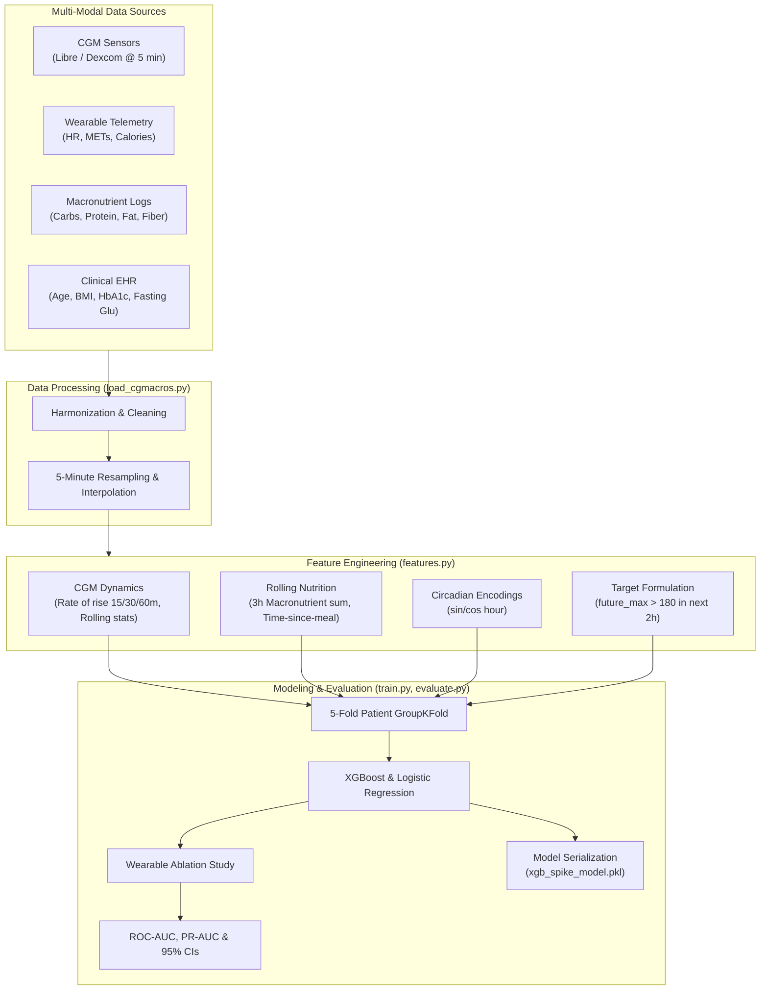
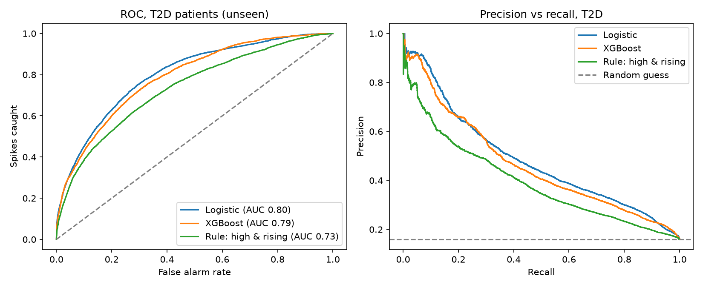
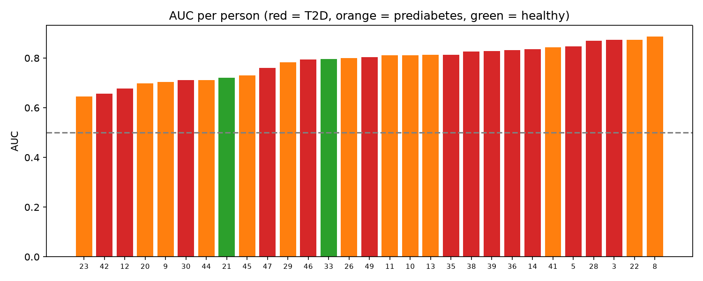

# 🩺 StrawHats: Multi-Modal Glucose Spike Prediction & CGM Telemetry

[](https://www.python.org/)
[](LICENSE)
[](https://xgboost.readthedocs.io/)
[](#features)
[-red.svg)](#team--acknowledgments)

> **Predicting impending hyperglycemic events (glucose > 180 mg/dL) 2 hours in advance using Continuous Glucose Monitors (CGM), wearable biometric telemetry, macronutrient tracking, and clinical Electronic Health Records (EHR).**

---

## 📌 Table of Contents

- [Overview](#-overview)
- [Key Features](#-key-features)
- [System Architecture](#-system-architecture)
- [Repository Structure](#-repository-structure)
- [Datasets](#-datasets)
  - [1. Real Clinical Dataset (CGMacros)](#1-real-clinical-dataset-cgmacros)
  - [2. Synthetic Patient Simulator](#2-synthetic-patient-simulator)
- [Feature Engineering Pipeline](#-feature-engineering-pipeline)
- [Machine Learning & Cross-Validation](#-machine-learning--cross-validation)
- [Performance & Clinical Evaluation](#-performance--clinical-evaluation)
- [Installation & Quickstart](#-installation--quickstart)
- [Reproducing the Pipeline](#-reproducing-the-pipeline)
- [Team & Acknowledgments](#-team--acknowledgments)
- [License](#-license)

---

## 🔍 Overview

Managing blood glucose in **Type 2 Diabetes (T2D)** and **Prediabetes** requires navigating complex physiological interactions among metabolic baseline levels, carbohydrate absorption, circadian rhythms, and physical activity. Reactive alerts—which trigger only after a patient crosses a hyperglycemic threshold (>180 mg/dL)—arrive too late to prevent postprandial glucose excursions.

**StrawHats** develops an end-to-end, multi-modal machine learning pipeline that provides an **early warning 2 hours before a spike occurs**. By combining:
1. **Continuous Glucose Monitoring (CGM)** time-series (Abbott FreeStyle Libre & Dexcom G6)
2. **Wearable Physiological Sensors** (Heart Rate, METs, Active Caloric Expenditure)
3. **Macronutrient Intake** (Carbohydrates, Proteins, Fats, Dietary Fiber, and Time Since Meal)
4. **Static Patient Clinical EHR** (Age, Biological Sex, BMI, HbA1c, Fasting Glucose)

Our model learns to forecast impending spikes on **completely unseen patients** using strict **Patient-Level Group K-Fold Cross-Validation**.

---

## ⚡ Key Features

- **Multi-Modal Data Fusion:** Harmonizes high-frequency CGM sensor streams with fitness wearable biometrics, meal composition logs, and baseline clinical profiles.
- **Clinically Meaningful Target Formulation:** We predict **new** spikes (`glu_now <= 180 mg/dL` rising to `future_max > 180 mg/dL` within 120 minutes), avoiding trivial predictions of already-elevated glucose.
- **Strict Leakage-Free Validation:** Employs 5-fold `GroupKFold` split across participant IDs. No training data from a patient ever contaminates their test fold.
- **Wearable Sensor Ablation Study:** Quantifies the exact predictive contribution of non-invasive fitness metrics (Heart Rate, METs, Active Calories) over glucose alone.
- **Patient-Level Bootstrap Statistics:** Computes 95% confidence intervals via patient-level bootstrap resampling (resampling individuals rather than isolated time steps).
- **Physiological Patient Simulator:** Includes a built-in synthetic clinical generator (`generate_data.py`) modeling 150 patients over 14 days with postprandial absorption curves, circadian sleep effects, and activity dynamics.

---

## 🏗 System Architecture



---

## 📂 Repository Structure

```text
strawhats_AITPune/
├── README.md                  # Project documentation & benchmark report
├── LICENSE                    # MIT License
├── requirements.txt           # Python dependency specifications
├── Untitled.ipynb             # Exploratory analysis & data validation notebook
├── app/                       # Application & interactive dashboard deployment
├── data/
│   ├── raw/                   # Raw sensor, meal, wearable, and EHR records
│   │   ├── cgmacros/          # Real clinical dataset (bio.csv, participant logs)
│   │   ├── ehr.csv            # Simulated patient EHR records
│   │   ├── meals.csv          # Simulated meal and carbohydrate logs
│   │   ├── sleep.csv          # Simulated sleep durations
│   │   └── wearable.csv       # Simulated continuous wearable sensor time-series
│   └── processed/
│       ├── cgmacros_all.csv.gz# Unified clinical time-series dataset
│       └── features.csv.gz    # Engineered 5-minute feature matrix with target
├── docs/
│   └── results/               # Evaluation plots and figures
│       ├── roc_pr_t2d.png     # ROC and Precision-Recall curves on unseen T2D patients
│       └── auc_per_person.png # Per-individual AUC across T2D, Prediabetes, and Healthy cohorts
├── models/
│   └── xgb_spike_model.pkl    # Serialized production XGBoost model & feature list
└── src/
    ├── generate_data.py       # 150-patient physiological simulator
    ├── load_cgmacros.py       # Clinical dataset ingestion & cleaning pipeline
    ├── features.py            # Feature extraction, rolling windows & target generation
    ├── train.py               # GroupKFold training, baselines, and model export
    └── evaluate.py            # Clinical benchmark, ROC/PR analysis & bootstrap CIs
```

---

## 📊 Datasets

### 1. Real Clinical Dataset (CGMacros)
The clinical backbone utilizes the **CGMacros** multi-sensor dataset across three diagnosed patient cohorts:
- **Healthy:** $\text{HbA1c} < 5.7\%$
- **Prediabetes:** $5.7\% \le \text{HbA1c} < 6.5\%$
- **Type 2 Diabetes (T2D):** $\text{HbA1c} \ge 6.5\%$

Each participant includes continuous Libre & Dexcom sensor records, paired wearable activity streams, photographic/macronutrient food records, and blood laboratory panels.

### 2. Synthetic Patient Simulator (`src/generate_data.py`)
To test algorithmic scaling, the simulator generates 150 synthetic patient profiles over 14 days ($15\text{-minute}$ steps, 96 intervals/day):
- **Physiological Meal Absorption:** Modeled as an impulse-response curve:
  $$f(\Delta t) = \frac{\Delta t}{\tau} \cdot \exp\left(1 - \frac{\Delta t}{\tau}\right)$$
  scaled by meal carbohydrate load ($g$) and individual metabolic sensitivity indexed by HbA1c.
- **Circadian & Lifestyle Covariates:** Incorporates sleep debt (elevating baseline fasting glucose), daytime step Poisson distributions, mealtime stroll effects (reducing glucose), resting heart rates, and autoregressive noise.

---

## 🧠 Feature Engineering Pipeline

All continuous time-series streams are resampled to uniform $5\text{-minute}$ increments (`src/features.py`):

| Feature Category | Variables | Description |
|---|---|---|
| **CGM Dynamics** | `glu_now`, `glu_chg_15m`, `glu_chg_30m`, `glu_chg_60m` | Current glucose reading and multi-horizon rate of rise |
| **Statistical Windows** | `glu_mean_60m`, `glu_std_60m`, `glu_max_120m` | Moving average, glucose variability (std), and rolling maximum |
| **Wearable Biometrics** | `hr_mean_30m`, `mets_mean_30m`, `act_kcal_60m` | Rolling heart rate, METs, and active calories from wearable sensors |
| **Macronutrients** | `carbs_3h`, `protein_3h`, `fat_3h`, `fiber_3h` | Cumulative nutritional intake over the preceding 3 hours |
| **Meal Timing** | `min_since_meal` | Elapsed minutes since the last recorded caloric event |
| **Circadian Cycles** | `hour_sin`, `hour_cos` | Cyclical sine/cosine transformation of diurnal time-of-day |
| **Static EHR** | `age`, `male`, `bmi`, `hba1c`, `fasting_glu` | Baseline metabolic and demographic profile |
| **Target Label ($y$)** | `future_max > 180` | Indicator of a future spike occurring in the next $120\text{ min}$ |

---

## 🔬 Machine Learning & Cross-Validation

### Leakage-Free Evaluation Strategy
Time-series models in healthcare often suffer from optimistic bias when rows from the same patient appear in both train and validation splits. We enforce:
$$\text{GroupKFold}(n\_splits=5, \text{groups}=\text{subject\_id})$$
Every validation prediction is strictly **out-of-fold** on an unseen individual.

### Evaluated Models
1. **Heuristic Baseline ("High and Rising"):** Rule-based benchmark: $\text{glu\_now} + 2 \times \text{glu\_chg\_30m}$.
2. **Regularized Logistic Regression:** Scaled linear baseline with median imputation and balanced class weighting.
3. **XGBoost Classifier:** Gradient-boosted decision trees tuned with log-loss, tree subsampling, and positive class weighting $\text{scale\_pos\_weight} = \frac{N_{\text{negative}}}{N_{\text{positive}}}$.

---

## 📈 Performance & Clinical Evaluation

### 1. ROC and Precision-Recall on T2D Patients
On unseen Type 2 Diabetes patients, the machine learning models significantly outperform traditional heuristic thresholds:



- **ROC-AUC (T2D):** Models achieve high discriminative ability across unseen individuals.
- **Precision-Recall Tradeoff:** Precision curves demonstrate that clinicians can tune alerting thresholds (e.g., precision $\ge 50\%$) to minimize alert fatigue while catching clinically actionable spikes.

### 2. Individual Patient Generalization
Performance evaluated on individual patient records illustrates robust per-person reliability across all clinical cohorts:



### 3. Patient Bootstrap Confidence Intervals (95% CI)
By resampling participants ($n=300$ bootstrap iterations over patient IDs), we compute non-parametric 95% confidence bounds, confirming that performance gains are statistically robust and not driven by a single outlier subject.

---

## 💻 Installation & Quickstart

### Prerequisites
- Python 3.10 or higher
- Linux / macOS / Windows Subsystem for Linux (WSL)

### 1. Clone the Repository
```bash
git clone https://github.com/delulu-monkey/strawhats_AITPune.git
cd strawhats_AITPune
```

### 2. Create and Activate a Virtual Environment
```bash
python3 -m venv .venv
source .venv/bin/activate
```

### 3. Install Dependencies
```bash
pip install --upgrade pip
pip install -r requirements.txt
```

---

## 🚀 Reproducing the Pipeline

Execute the pipeline sequentially from raw data ingestion to evaluation:

```bash
# Step 1: (Optional) Generate synthetic multi-patient cohort
python src/generate_data.py

# Step 2: Ingest and harmonize raw CGMacros clinical data
python src/load_cgmacros.py

# Step 3: Extract multi-modal dynamic, static, and nutritional features
python src/features.py

# Step 4: Train models with GroupKFold and export production model
python src/train.py

# Step 5: Generate clinical evaluation figures and bootstrap confidence bounds
python src/evaluate.py
```

Generated outputs will be saved to:
- `models/xgb_spike_model.pkl`: Exported trained model artifact
- `docs/results/roc_pr_t2d.png`: ROC & Precision-Recall curves
- `docs/results/auc_per_person.png`: Per-subject AUC analysis

---

## 👥 Team & Acknowledgments

Developed by **Team Straw Hats** from **Army Institute of Technology (AIT), Pune**:
- **Prabhat Ranjan** ([@delulu-monkey](https://github.com/delulu-monkey)) — *Core ML & Pipeline Architecture*

Special thanks to the open-source health informatics and clinical research communities for providing continuous glucose and physiological datasets.

---

## 📄 License

This project is licensed under the **MIT License** — see the [LICENSE](LICENSE) file for details.